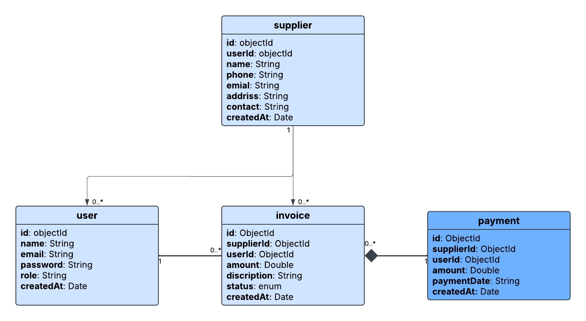

# 📊 Smart Invoice & Fournisseur Management API
### 🔍 Use Case Diagram

  

---

### 🧩 Class Diagram

  

---

## 🧠 Project Architecture

Client (Postman / Frontend)  
↓  
Routes (Express.js)  
↓  
Controllers (Business Logic)  
↓  
Models (MongoDB / Mongoose)  
↓  
Database (MongoDB Atlas / Local)

---

## 📐 System Design Diagrams

### 🔍 Use Case Diagram

  

### 🧩 Class Diagram

  

---

## 🧠 Project Context

This API is designed to help freelancers and companies manage their financial operations including suppliers, invoices, and payments in a structured and automated way.

---

## 🎯 Key Features

- Secure authentication (JWT)
- Fournisseur management (CRUD)
- Facture management with status tracking
- Partial & full payments
- Automatic invoice status calculation
- Supplier statistics
- Global dashboard analytics
- Data isolation per user

---

## 🔐 Authentication (JWT)

The API uses JWT for authentication.

Authorization header:
Authorization: Bearer <token>

## 🛠️ Tech Stack

- Node.js
- Express.js
- MongoDB
- Mongoose
- JWT

## 👨‍💻 Author

Hiba Boudiaj
